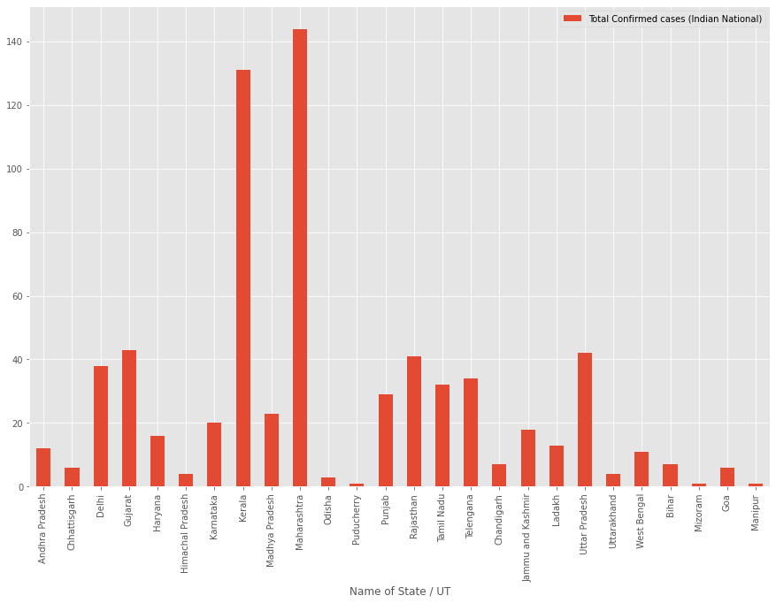
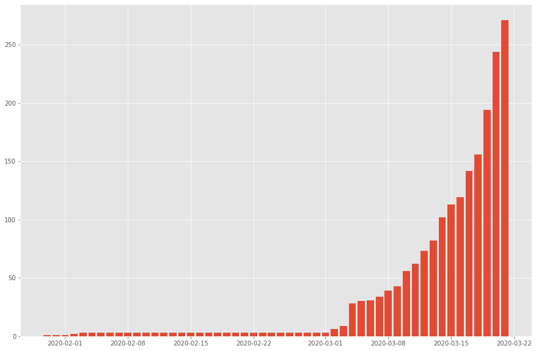

# COVID-19 Visualization Project

## Overview
This project aims to visualize COVID-19 cases in India using Python and various libraries such as Seaborn, Folium, and Matplotlib. The project includes plots of bar charts, maps, and graphs to represent the spread and distribution of COVID-19 cases across different states in India.

## Requirements
- Python 3.x
- Pandas
- NumPy
- Seaborn
- Folium
- Matplotlib

## Installation
1. Clone the repository:
2. Install the required dependencies:
   ## Usage
1. Ensure you have the required Python libraries installed.
2. Run the Jupyter notebook `covid_visualization.ipynb` to see the visualizations.
3. The notebook contains code snippets for plotting bar charts, maps, and other visualizations related to COVID-19 cases in India.

## Files
- `covid_visualization.ipynb`: Jupyter notebook containing the code for visualizing COVID-19 data.
- `data/`: Directory containing the dataset(s) used for visualization.
- `figures/`: Directory containing figures generated from the visualizations.

## Example Figures

*Figure 1: Bar chart showing the total number of COVID-19 cases in different states of India.*

*Figure 2: Map displaying the distribution of COVID-19 cases across various states in India.*

## Data Source
The COVID-19 data used in this project is sourced from [source_name], available at [data_source_link].

## Contributors
- [Your Name](https://github.com/yourusername)
